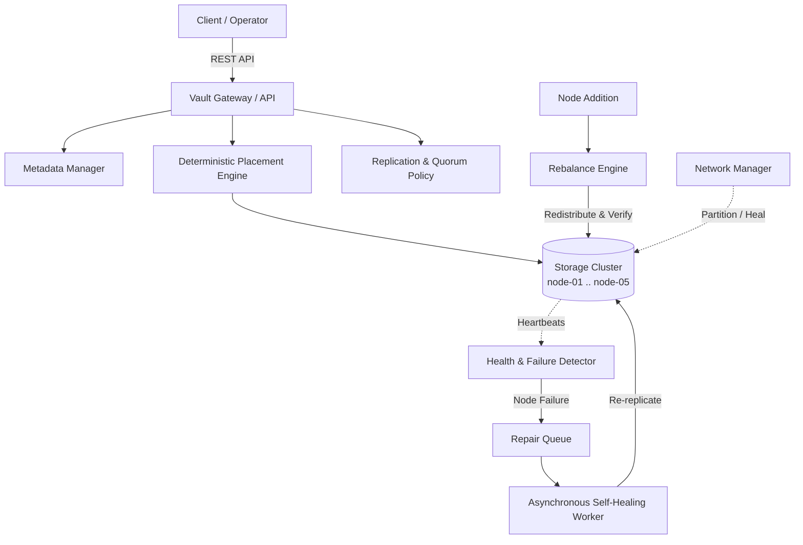

# VAULT — Distributed Fault-Tolerant Object Storage Engine

Vault is a lightweight, fault-tolerant distributed object storage system with quorum-based durability, SHA-256 cryptographic verification, continuous heartbeat failure detection, automatic self-healing repair queues, simulated network partition isolation, and dynamic placement rebalancing.

---

## 1. The Distributed Storage Problem

Modern cloud storage systems must store unstructured data durably while hardware nodes continually fail, reboot, corrupt data, or suffer network isolation. Simple single-node storage architectures create single points of failure. Vault solves this by decoupling the client gateway from physical storage nodes, utilizing deterministic placement algorithms, multi-replica quorum write guarantees, continuous background integrity scanning, asynchronous self-healing, and partition reconciliation without external distributed dependencies.

---

## 2. System Architecture

```
                    CLIENT
                      │
                      ▼
               VAULT API / GATEWAY
                      │
        ┌─────────────┼─────────────┐
        │             │             │
        ▼             ▼             ▼
   METADATA       PLACEMENT      POLICY
   MANAGER         ENGINE        ENGINE
        │             │
        └──────┬──────┘
               │
       ┌───────┼───────┬───────┐
       ▼       ▼       ▼       ▼
    NODE-01 NODE-02 NODE-03 NODE-04 ... NODE-05
       │       │       │       │
       └───────┼───────┴───────┘
               │
      ┌────────┴────────┐
      ▼                 ▼
   REPAIR           REBALANCE
   WORKER             ENGINE
      │
      ▼
 INTEGRITY / SHA-256
```

### Architectural Flow (Mermaid)



---

## 3. Core Capabilities

*   **Configurable Multi-Replica Durability**: Configurable Replication Factor ($RF \ge 1$), Write Quorum ($WQ$), and Read Quorum ($RQ$). Objects are persisted only after reaching write quorum acknowledgments.
*   **Cryptographic SHA-256 Integrity**: End-to-end verification during upload, download, recovery, and rebalancing. Bit rot or disk corruption is identified and quarantined.
*   **Automatic Failure Detection**: Continuous heartbeat monitoring marks nodes `OFFLINE` if heartbeats lapse beyond timeout thresholds ($6000\text{ ms}$).
*   **Prioritized Asynchronous Self-Healing**: Automatically schedules repairs when object replicas drop below policy thresholds. Corrupted or missing replicas trigger prioritized background reconstruction from surviving healthy replicas.
*   **Validated Node Recovery**: Recovered nodes enter a `RECOVERING` state where existing replicas on disk are re-verified against metadata checksums before the node transitions back to `ONLINE`.
*   **Network Partition Simulation & Reconciliation**: $N \times N$ matrix allows simulating network partitions between node pairs. Partitioned nodes remain alive but isolated; healing initiates automated reconciliation scans.
*   **Dynamic Topology Rebalancing**: Adding new storage nodes automatically schedules background rebalancing, copying replicas to optimal targets and verifying SHA-256 checksums before pruning obsolete copies.

---

## 4. Technology Stack

*   **Frontend**: React 19, Vite 8, TypeScript, Vanilla CSS (Restrained Dark Control Plane: `#0B0D10` background, `#11151A` surface, `#252B33` borders)
*   **Backend**: Node.js, Express 5, TypeScript (`tsx` runtime)
*   **Storage Medium**: Local filesystem simulation (`storage/node-01` through `storage/node-05`)
*   **Metadata Persistence**: Atomic JSON metadata journal (`storage/metadata.json`)
*   **Cryptographic Verification**: Native Node.js `crypto` (SHA-256)
*   **Communication**: REST API + JSON over HTTP

---

## 5. Running Locally

### Prerequisites
*   Node.js 18+ (tested on Node.js v20+)
*   npm

### Quick Start

1. **Install Dependencies**:
```bash
# In vault root:
npm install

# In server directory:
cd server && npm install && cd ..

# In client directory:
cd client && npm install && cd ..
```

2. **Run Backend & Frontend**:

**Terminal 1 (Backend on port 3001)**:
```bash
cd server
npm run dev
```

**Terminal 2 (Frontend on port 5173)**:
```bash
cd client
npm run dev
```

Open your browser to: [http://localhost:5173](http://localhost:5173)

### Running Automated Test Suites

```bash
# Run all automated tests:
npm test

# Or run individual test phases:
npm run test:phase1       # Upload, download, metadata, checksum verification
npm run test:phase2       # Replication, quorum, corruption scan, storage accounting
npm run test:phase3       # Node failure, self-healing repair, recovery validation
npm run test:phase4       # Network partitions, partition healing, rebalancing
npm run test:persistence  # Cross-restart metadata and replica persistence
```

### Reproducible Cluster Reset

To return the cluster to a clean initial state (4 online nodes, empty storage, default policy):

```bash
npm run reset
```

---

## 6. Deterministic 5-Minute Demo Flow

Follow this sequence to present Vault to judges:

| Step | Action | What Happens / What to Explain |
| :--- | :--- | :--- |
| **1. Healthy Cluster** | Open **Overview** tab | Show 4 storage nodes `ONLINE`, 0 active repairs, cluster `HEALTHY`. Point out the clean 4-level progressive disclosure layout. |
| **2. Upload Object** | Click **Objects** $\rightarrow$ **Upload Object** | Select a file (`test.json`). Show instant SHA-256 checksum calculation, replica placement across 3 nodes, and write quorum confirmation. |
| **3. Node Failure** | Navigate to **Nodes** $\rightarrow$ Click **Fail** on `node-02` | `node-02` status transitions to `OFFLINE`. Show cluster banner update to `DEGRADED`. |
| **4. Self-Healing** | Navigate to **Repairs** tab | Watch the prioritized repair task trigger automatically: `QUEUED` $\rightarrow$ `REPAIRING` $\rightarrow$ `COMPLETED`. An intact replica from surviving nodes is written to `node-04`. |
| **5. Network Partition** | Navigate to **Network** tab | Create a partition between `node-01` and `node-03`. Emphasize to judges: *“The nodes are still healthy and running, but communication across the network boundary is blocked.”* |
| **6. Heal Partition** | Click **Heal** on the partition | Connectivity restores immediately; reconciliation scans trigger automatically. |
| **7. Add Node** | Navigate to **Nodes** $\rightarrow$ Click **+ Add Storage Node** (`node-05`) | `node-05` joins cluster topology with 0 bytes used. |
| **8. Rebalance** | Navigate to **Rebalance** $\rightarrow$ Click **Run Rebalance** | Vault computes placement diffs, migrates replicas to `node-05`, verifies destination checksums, and purges obsolete copies. |

---

## 7. Deployment & Durability Notes

*   **Storage Simulation**: For hackathon evaluation and demonstrations, Vault operates using local filesystem storage paths (`storage/node-XX`).
*   **Durability in Container/Cloud Deployments**: If deployed to serverless or ephemeral container runtimes (e.g. AWS Lambda, basic Vercel serverless), the local filesystem is ephemeral. For long-term hosted durability, persistent volume mounts (e.g., Docker volumes, EBS, PersistentVolumeClaims) should back the storage directory.
*   **GitHub Pages Dashboard Deployment**: The client-side dashboard is automatically built and deployed to GitHub Pages via a GitHub Actions workflow (`.github/workflows/deploy-pages.yml`). In production builds, the client connects to the backend API via a dynamic base URL (`/api`).
